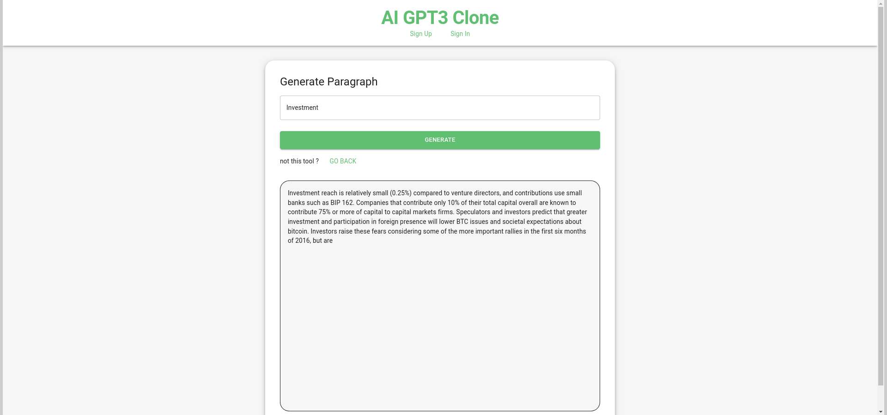

# ChatGPT Clone

This is a **ChatGPT clone** built using modern web development technologies. The project is structured into two submodules for the backend and frontend. It demonstrates how to create a chatbot using **React.js**, **Node.js**, **Express.js**, and **MongoDB**.

## Table of Contents
- [Overview](#overview)
- [Technologies Used](#technologies-used)
- [Project Structure](#project-structure)
- [Features](#features)
- [Live Demo](#live-demo)
- [Screenshots](#screenshots)
- [Installation](#installation)
- [Running The Application](#running-the-application)
- [Usage](#usage)
- [Contributing](#contributing)
- [Acknowledgments](#acknowledgments)
- [License](#license)

## Overview

This project is a clone of OpenAI's ChatGPT, where users can interact with an AI-powered chatbot. It simulates natural conversations, with the frontend built in **React.js** and the backend using **Node.js**, **Express.js**, and **MongoDB**.

## Technologies Used

### Frontend:
- **React.js**: For creating the user interface and handling user interactions.
- **Axios**: For making HTTP requests to the backend.

### Backend:
- **Node.js**: JavaScript runtime for backend development.
- **Express.js**: Web framework for Node.js.
- **MongoDB**: NoSQL database to store chat logs or user sessions.

## Project Structure

The project is divided into two submodules:
- **frontend/**: Contains the React.js frontend code.
- **backend/**: Contains the Node.js/Express.js backend code with MongoDB integration.

## Features

- Interactive chat interface similar to ChatGPT.
- Real-time AI conversation using backend APIs.
- Persistent chat history using MongoDB.

## Live Demo

You can check out the live version of the ChatGPT clone here:

- **Live wokring of ChatGPT**: [Live URL](https://chat-gpt-clone-kartik-rao.vercel.app/)


## Screenshots

Here are some screenshots showcasing the live project:

1. **Home Page**: 
   
   
2. **Chat Interface**: 
   
   

## Installation

To set up this project locally, follow the steps below:

### Prerequisites
Ensure you have the following installed:
- **Node.js**: v14 or above
- **MongoDB**: Locally or using MongoDB Atlas
- **Git**: For cloning the repository

### Steps

1. Clone the main repository:
   ```bash
   git clone https://github.com/Kartik-Rao11/Chat-gpt-clone
2. Initialize the submodules:
    ```bash
    git submodule update --init --recursive
3. Navigate to the backend and frontend directories to install dependencies:
    - **For backend**:
        ```bash
        cd backend
        npm install
    - **For frontend**:
        ```bash
        cd ../frontend
        npm install
## Running the Application

1. **Start the Backend**

    - Navigate to the backend directory.
    - Start the backend server:
        ```bash
        npm start
    The backend will be running on http://localhost:8080.


2. **Start the Frontend**

    - Navigate to the frontend directory.
    - Start the frontend server:
        ```bash
        npm start
    The frontend will be running on http://localhost:3000

## Usage

Once both frontend and backend servers are running, you can open the frontend on your browser and interact with the AI-powered chatbot.

## Acknowledgments
- Inspired by the advancements in AI and machine learning.
- Thanks to the open-source community for providing valuable resources and libraries.

## Contributing
Feel free to submit issues or create pull requests to improve the project. Contributions are welcome!

## License
This project is licensed under the MIT License.

 


